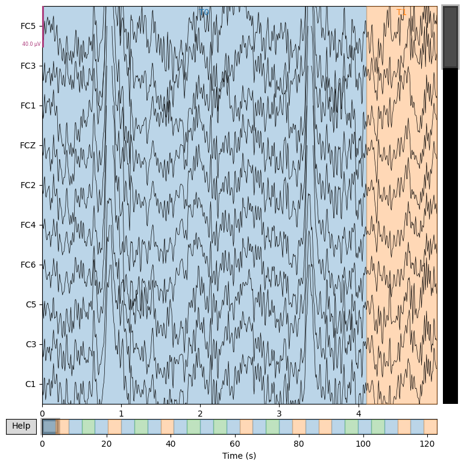
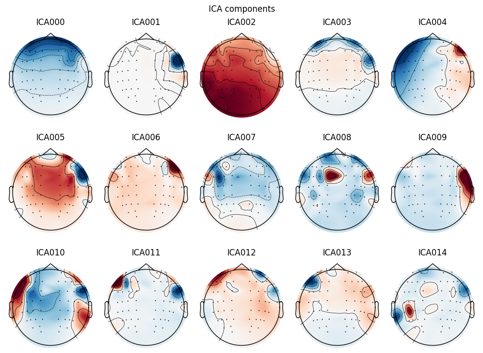
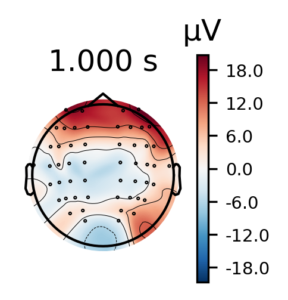
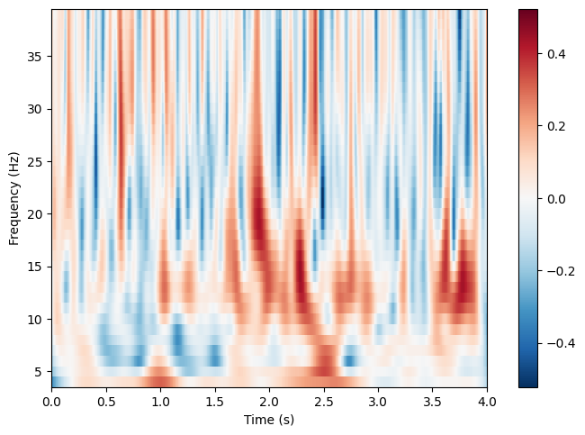
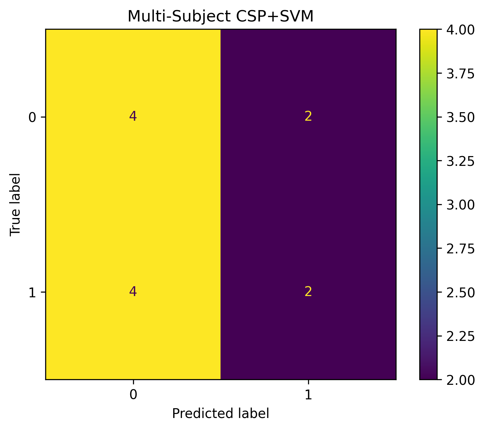
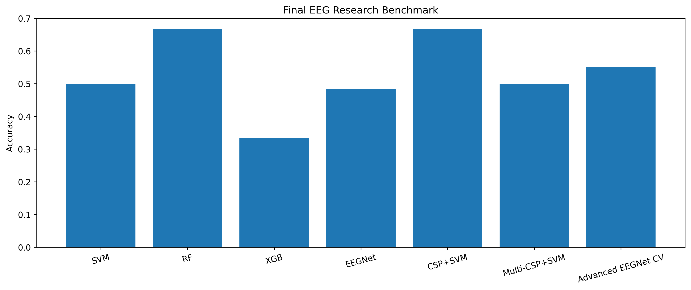
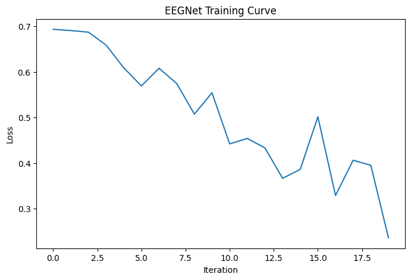

# EEG Motor Imagery Classification using MNE-Python & Deep Learning

Advanced EEG signal processing and motor imagery classification pipeline using MNE-Python, classical machine learning, CSP filtering, and deep learning architectures.


# Open in Google Colab

Paste this badge at the top of your GitHub README:

[](https://colab.research.google.com/drive/1ZzYJCn3Bh8Xm3oseZIZyODRztNdgArER?usp=sharing)

Example:


# Project Overview

This repository presents a complete end-to-end EEG research pipeline for:

* EEG preprocessing
* Artifact removal using ICA
* Spectral analysis
* Event extraction
* Epoch generation
* Time-frequency analysis
* ERP visualization
* Topographic brain mapping
* Motor imagery decoding
* Classical ML benchmarking
* Deep Learning classification with EEGNet

The project is based on the PhysioNet EEG Motor Movement/Imagery Dataset and implemented entirely in Python.


# Repository Structure

```text
EEG-Motor-Imagery-Classification/
│
├── figures/
│   ├── raw_eeg.png
│   ├── psd.png
│   ├── ica_components.png
│   ├── topomap.png
│   ├── time_frequency.png
│   ├── confusion_matrix.png
│   ├── benchmark_models.png
│   └── training_curve.png
│
├── notebooks/
│   └── eeg_pipeline.ipynb
│
├── data/
│   └── EDF files
│
├── requirements.txt
├── README.md
└── LICENSE
```

# Dataset

Dataset used:

* EEG Motor Movement/Imagery Dataset
* Source: PhysioNet

Subjects perform:

* Left hand motor imagery
* Right hand motor imagery
* Real motor movement tasks

Sampling frequency:

```math
160 \ Hz
```

EEG channels:

```math
64 \ channels
```


# EEG Processing Pipeline

```text
Raw EEG
   ↓
Bandpass Filtering
   ↓
Notch Filtering
   ↓
ICA Artifact Removal
   ↓
Event Extraction
   ↓
Epoching
   ↓
Feature Extraction
   ↓
CSP Spatial Filtering
   ↓
Machine Learning / Deep Learning
   ↓
Evaluation & Visualization
```


# Technologies Used

* Python
* NumPy
* Matplotlib
* Scikit-learn
* XGBoost
* PyTorch
* MNE-Python


# EEG Preprocessing

## Bandpass Filtering

Applied frequency range:

```math
1 \ Hz \leq f \leq 40 \ Hz
```

Purpose:

* Remove DC drift
* Remove high-frequency noise
* Preserve neural rhythms


## Notch Filtering

Power-line noise suppression:

```math
f = 60 \ Hz
```


## Independent Component Analysis (ICA)

Artifact removal using ICA:

```math
X = AS
```

Where:

* (X): observed EEG signals
* (A): mixing matrix
* (S): independent sources

ICA was used to suppress:

* Eye blinks
* Muscle artifacts
* Noise components


# Feature Extraction

## Common Spatial Pattern (CSP)

Spatial filtering was applied to maximize variance differences between motor imagery classes.

Optimization objective:

```math
W^T C_1 W = \lambda
```

Where:

* (C_1): covariance matrix
* (W): spatial filters


# Deep Learning Architecture

## EEGNet

Implemented lightweight EEGNet architecture using PyTorch.

Architecture components:

* Temporal convolution
* Spatial convolution
* Batch normalization
* Average pooling
* Dropout regularization

Loss Function:

```math
\mathcal{L} = - \sum y \log(\hat{y})
```

Optimizer:

* Adam


# Model Benchmark Results

| Model                 | Accuracy |
| --------------------- | -------- |
| SVM                   | 50.0%    |
| Random Forest         | 66.7%    |
| XGBoost               | 33.3%    |
| EEGNet                | 48.3%    |
| CSP + SVM             | 66.7%    |
| Multi-Subject CSP+SVM | 50.0%    |
| Advanced EEGNet CV    | 55.0%    |


# Visualizations

## Raw EEG Signals

Visualization of multichannel EEG recordings before preprocessing.




## Power Spectral Density (PSD)

Frequency-domain analysis showing neural rhythms.


## ICA Components

Independent components extracted for artifact removal.




## ERP Topographic Mapping

Spatial distribution of cortical activity.




## Time-Frequency Representation

Motor imagery dynamics across time and frequency.




## Confusion Matrix

Classification performance visualization.




## Benchmark Comparison

Performance comparison between all models.




## EEGNet Training Curve

Training loss convergence over iterations.




# Research Highlights

* Complete EEG research workflow
* Motor imagery decoding
* CSP-based feature extraction
* Multi-subject EEG analysis
* Deep learning EEG classification
* Scientific EEG visualization
* Reproducible neuroscience pipeline


# Future Improvements

Potential future extensions:

* Transformer-based EEG models
* Graph Neural Networks
* Cross-subject transfer learning
* Self-supervised EEG learning
* Real-time BCI systems
* Explainable AI for EEG


# Installation

```bash
pip install -r requirements.txt
```


# Running the Project

Clone repository:

```bash
git clone https://github.com/YOUR_USERNAME/EEG-Motor-Imagery-Classification.git
```

Enter project directory:

```bash
cd EEG-Motor-Imagery-Classification
```

Run notebook:

```bash
jupyter notebook
```

Open:

```text
notebooks/eeg_pipeline.ipynb
```


# Google Colab Execution

Upload EDF files to Colab.

Then execute all notebook cells sequentially.

Required packages:

```python
!pip install mne pyedflib torch xgboost scikit-learn
```


# Citation

```bibtex
@misc{eeg_motor_imagery_project,
  title={EEG Motor Imagery Classification using MNE-Python and Deep Learning},
  author={Ali Mohammadpour},
  year={2026}
}
```


# License

MIT License

